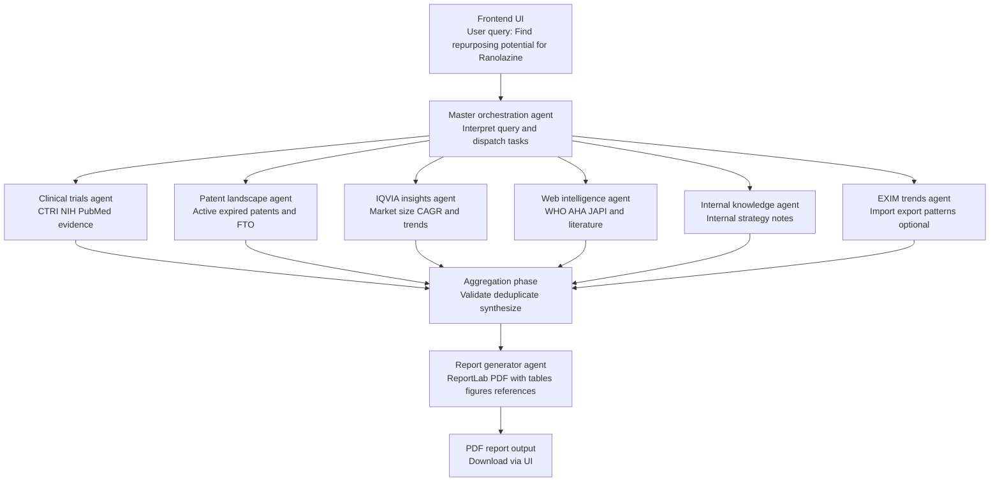

# IndiCure AI

IndiCure AI is an agent-based AI system for **drug repurposing analysis**, designed to aggregate clinical evidence, patent intelligence, market signals, and biomedical literature into a **structured, decision-ready PDF report**.

The platform combines modular AI agents with a web-based dashboard to support exploratory and strategic analysis, demonstrated using **Ranolazine → HFpEF (India)** as a reference workflow.

---

## Key Capabilities

- Agent-orchestrated biomedical reasoning
- Multi-source evidence aggregation (clinical, patent, market, web)
- Automated structured PDF report generation
- Interactive frontend dashboard with downloadable reports
- Modular architecture suitable for extension to new drugs or indications

---

## System Architecture

### High-Level Workflow

1. **User Query**  
   Example: _“Find repurposing potential for Ranolazine”_

2. **Master Orchestration Agent**
   - Interprets the query
   - Decomposes it into sub-tasks
   - Dispatches tasks to specialized worker agents

3. **Worker Agents**
   - **IQVIA Insights Agent**  
     Market size, CAGR, therapy trends
   - **EXIM Trends Agent**  
     API and formulation import/export patterns
   - **Patent Landscape Agent**  
     Active/expired patents, FTO signals
   - **Clinical Trials Agent**  
     Trial data by molecule and indication (CTRI, NIH)
   - **Web Intelligence Agent**  
     PubMed, WHO, AHA, JAPI, and related sources
   - **Internal Knowledge Agent**  
     Internal strategy notes and reports

4. **Aggregation Phase**
   - Master agent validates and synthesizes all outputs
   - Conflicting or weak signals are filtered

5. **Report Generator**
   - Converts structured outputs into a formatted PDF
   - Includes tables, figures, and references

6. **Frontend Delivery**
   - Results dashboard
   - One-click PDF download

---

## Key Technology Components

### LLM-Powered Reasoning
- GPT-5 via LangChain and LangGraph
- Structured JSON outputs for downstream validation and reporting

### Modular Agent Deployment
- Independent FastAPI-based agents
- Designed for scalability and isolation of concerns

### Data Integration and Standardization
- REST API ingestion from biomedical and IP sources
- Pydantic models ensure schema consistency

### Semantic Analysis and Reporting
- Entity linking (drug → target → disease)
- Structured tabular summaries and visualizations
- Automated PDF assembly using ReportLab

---

## System Workflow

1. **User Query (Frontend)**
   - Example: *"Find repurposing potential for Ranolazine"*

2. **Master Orchestration Agent**
   - Interprets query
   - Breaks it into subtasks
   - Dispatches work to specialized agents

3. **Worker Agents**
   - **Clinical Agent**: Extracts trial and medical evidence
   - **Patent Agent**: Analyzes active/expired patents and FTO risk
   - **IQVIA Agent**: Assesses market size and therapy trends
   - **Web Agent**: Searches PubMed, WHO, AHA, JAPI, etc.
   - **Internal Agent**: Summarizes internal strategy inputs

4. **Aggregation Phase**
   - Master agent validates and synthesizes outputs

5. **Report Generator**
   - Produces a structured **PDF report**
   - Includes figures, tables, summaries, and hyperlinked references

---

## Key Technology Components

- **LLM Reasoning**
  - GPT-5 via LangChain + LangGraph
  - Structured JSON outputs for validation and reporting

- **Modular Agent Architecture**
  - Each agent runs independently
  - Scalable and extensible design using FastAPI

- **Data Standardization**
  - Pydantic models ensure consistent downstream reasoning

- **Automated Reporting**
  - ReportLab for PDF generation
  - Matplotlib (non-interactive backend) for figures

---
## Mermaid Diagrams

### System Workflow (End-to-End)



## Setup Instructions

### Backend

```bash
cd backend
python3 -m venv .venv
source .venv/bin/activate
pip install -r requirements.txt
uvicorn main:app --reload
```

### Frontend

```bash
cd frontend
npm install
npm run dev

```
### Running the Full System

1. Start the **backend** (FastAPI).
2. Start the **frontend** (Vite development server).
3. Open the frontend UI in your browser.
4. Run a query (e.g., *Ranolazine → HFpEF*).
5. Download the generated **PDF report** from the dashboard.

## Roadmap / Future Work

- **Agent Reliability**
  - Replace demo outputs with real data pipelines (PubMed, CTRI, NIH, patents, market data).
  - Add retries, caching, and structured logging per agent.

- **Evidence Quality**
  - Introduce evidence grading and confidence scores across Clinical, Safety, Patent/FTO, and Market signals.
  - Handle conflicting evidence via defined resolution rules.

- **Enhanced PDF Reports**
  - Expand sections (mechanism, safety, trials, India unmet need, competition).
  - Add richer figures (evidence radar, timelines, risk vs signal).
  - Enable fully hyperlinked references.

- **Frontend Improvements**
  - Per-agent progress updates and partial results.
  - Report preview, query history, and multi-format exports (PDF/JSON/CSV).

- **Data, Security & Extensibility**
  - Database-backed caching and report metadata.
  - API authentication, rate limiting, and CI checks.
  - Pluggable agents, geography-based routing, and multiple report templates.

---

**Note:**  
This system is a **project prototype developed for EY Techathon – Stage 2** and is intended to demonstrate architecture, agent orchestration, and reporting workflows rather than serve as a production-ready platform.